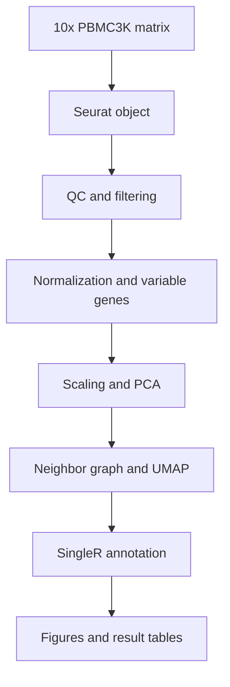
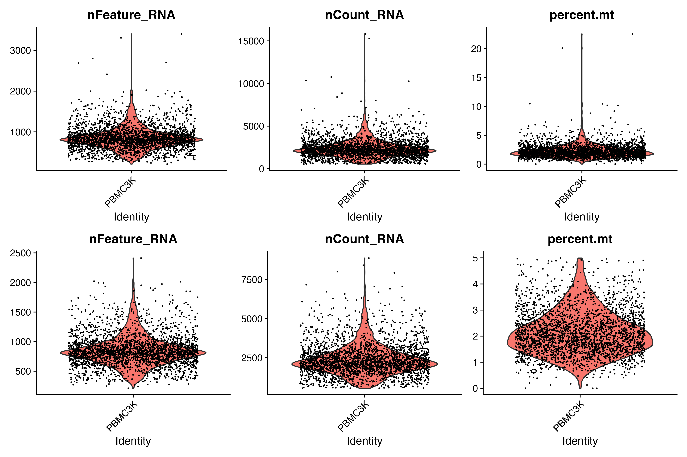
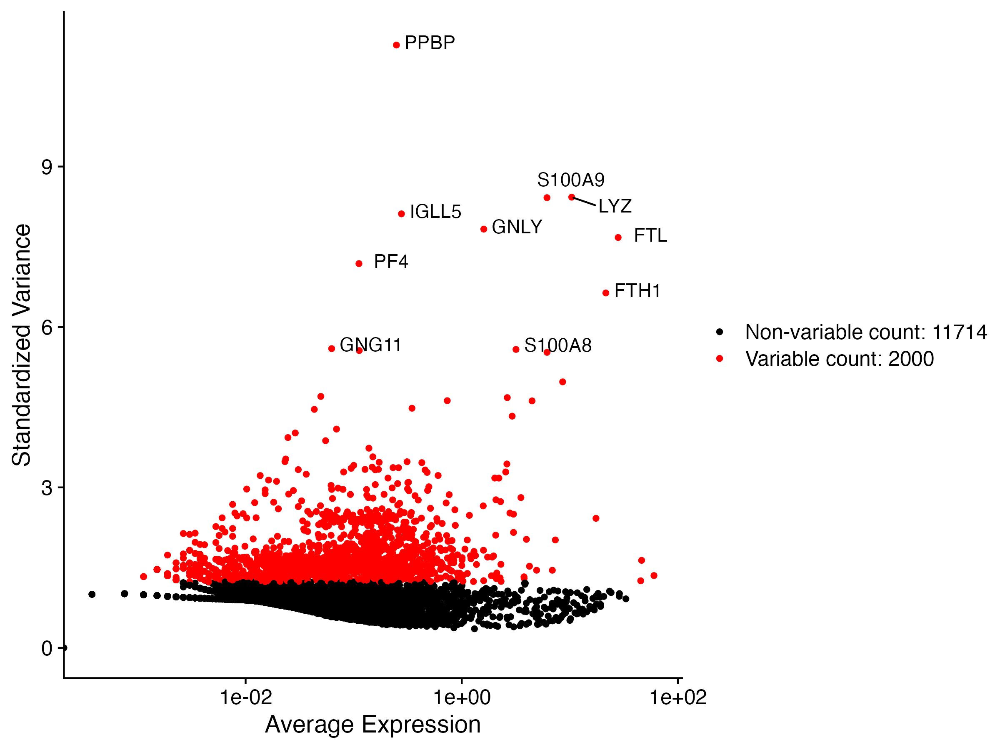
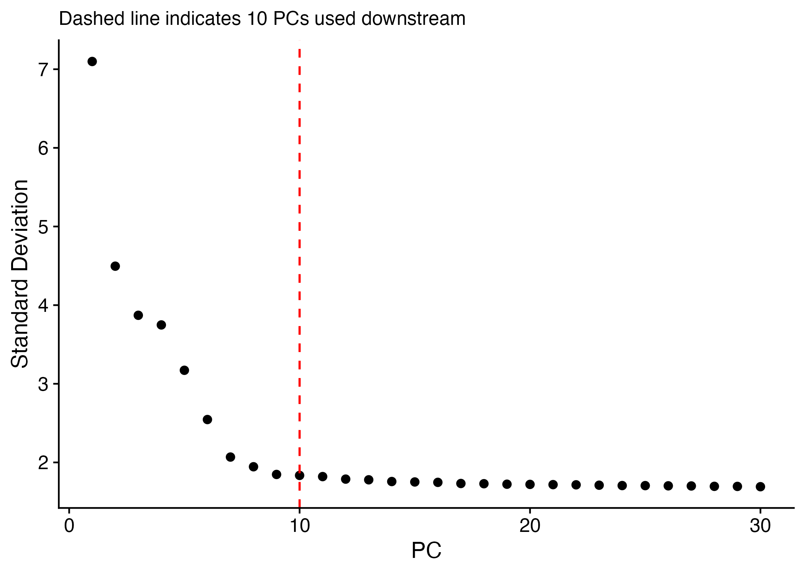
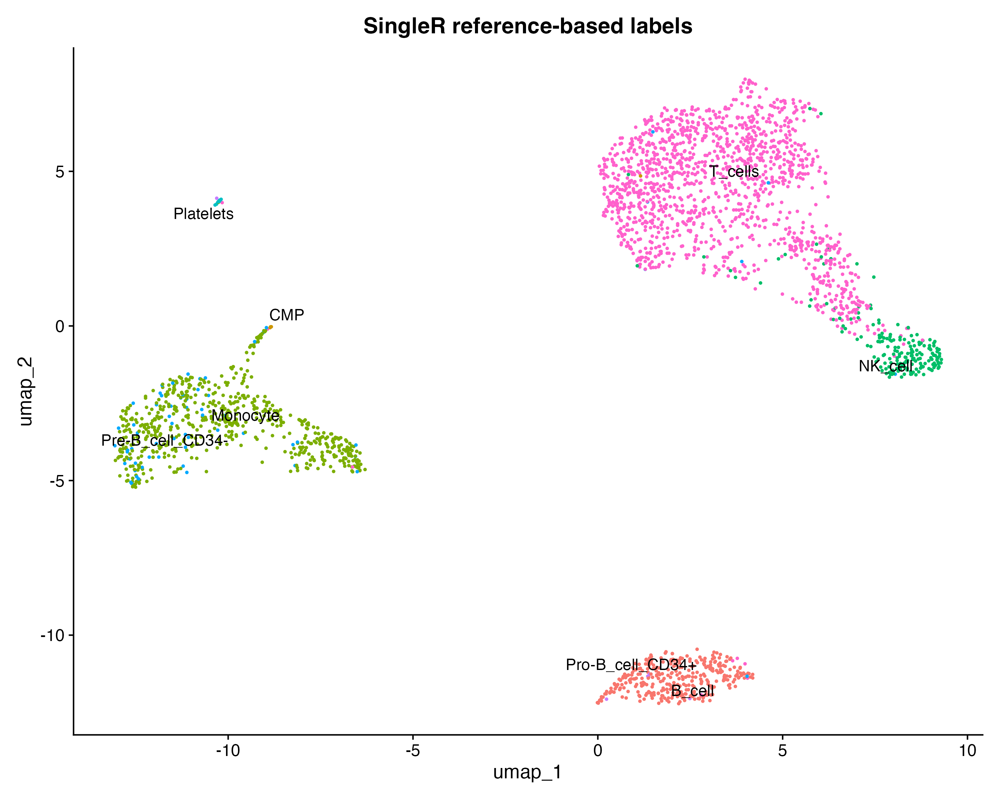

# Single-Cell RNA-seq Analysis of Human PBMCs

[](https://www.r-project.org/)
[](https://satijalab.org/seurat/)
[](https://bioconductor.org/packages/SingleR)
[](https://www.10xgenomics.com/datasets/3-k-pbm-cs-from-a-healthy-donor-1-standard-1-1-0)

## Overview

This project demonstrates a reproducible downstream single-cell RNA-sequencing workflow using the publicly available 10x Genomics PBMC3K dataset. The analysis was performed in R with Seurat and includes quality control, cell filtering, log normalization, highly variable feature selection, expression scaling, principal component analysis, UMAP visualization, and reference-based cell annotation with SingleR.

The project emphasizes transparent analytical decisions and reproducible organization of data, code, figures, and tabular results. It was developed as a bioinformatics portfolio project to demonstrate practical experience with Linux, R Markdown, Seurat, Bioconductor, sparse single-cell expression matrices, and automated cell-type annotation.

## Dataset

The PBMC3K dataset contains peripheral blood mononuclear cells from one healthy donor. According to 10x Genomics, 2,700 cells were detected after sequencing on an Illumina NextSeq 500 at approximately 69,000 reads per cell. The dataset was originally processed with Cell Ranger 1.1.0 and is distributed under a Creative Commons Attribution 4.0 license.

- **Organism:** Human
- **Tissue:** Peripheral blood
- **Sample:** Unsorted PBMCs from one healthy donor
- **Assay:** 10x Genomics 3′ single-cell gene expression
- **Recovered cells:** 2,700
- **Downstream input:** Cell Ranger filtered gene-barcode matrix
- **Dataset page:** [3k PBMCs from a Healthy Donor](https://www.10xgenomics.com/datasets/3-k-pbm-cs-from-a-healthy-donor-1-standard-1-1-0)
- **Filtered count matrix:** [pbmc3k_filtered_gene_bc_matrices.tar.gz](https://cf.10xgenomics.com/samples/cell/pbmc3k/pbmc3k_filtered_gene_bc_matrices.tar.gz)

The results shown in this repository were generated from the published PBMC3K filtered count matrix. Reprocessing raw reads with a different Cell Ranger or reference version may produce slightly different cell calls and gene counts.

## Project objectives

1. Import a sparse 10x Genomics feature-barcode matrix into Seurat.
2. Evaluate cell quality using detected genes, UMI counts, and mitochondrial percentage;
3. remove low-quality and unusually complex cell profiles;
4. normalize gene expression and identify informative variable genes;
5. summarize transcriptional variation using PCA;
6. visualize cell-level transcriptional structure with UMAP; and
7. assign candidate cell identities using SingleR and a curated human reference.

## Workflow



## Repository structure

```text
End-to-End-Single-Cell-RNA-Seq/
├── Data/
│   └── hg19/
│       ├── barcodes.tsv
│       ├── genes.tsv
│       └── matrix.mtx
├── Figures/
│   ├── 01_qc_before_after.png
│   ├── 02_variable_features.png
│   ├── 03_pca_elbow.png
│   ├── 04_umap_clusters.png
│   ├── 05_marker_dotplot.png
│   └── 08_umap_singler_labels.png
├── Results/
│   ├── qc_summary.csv
│   ├── cluster_cell_counts.csv
│   ├── cluster_markers.csv
│   ├── singler_cell_labels.csv
│   └── pbmc_seurat_processed.rds
├── Scripts/
│   └── PBMC_Seurat_analysis.Rmd
├── End-to-End Single-Cell RNA-Seq.Rproj
├── README.md
└── .gitignore
```

The processed Seurat object is approximately 274 MB and exceeds GitHub's normal 100 MB per-file limit. It should remain excluded through `.gitignore` and be regenerated by rendering the R Markdown analysis.

## Download the data on Linux

From the project root:

```bash
mkdir -p Data
cd Data

wget https://cf.10xgenomics.com/samples/cell/pbmc3k/pbmc3k_filtered_gene_bc_matrices.tar.gz
tar -xzf pbmc3k_filtered_gene_bc_matrices.tar.gz

cd ..
```

The extracted directory contains the `hg19` matrix used by the R Markdown report:

```text
Data/filtered_gene_bc_matrices/hg19/
```

If the extracted `hg19` directory is moved directly under `Data/`, as in this repository, use:

```bash
mv Data/filtered_gene_bc_matrices/hg19 Data/hg19
rmdir Data/filtered_gene_bc_matrices
```

The analysis parameter should then be:

```yaml
data_dir: "Data/hg19"
```

## Optional raw-read processing with Cell Ranger

The downstream results in this repository use the published PBMC3K matrix. For a separate command-line demonstration beginning with raw FASTQs, 10x Genomics provides an official PBMC1K v3 Cell Ranger tutorial dataset. Do not describe the PBMC1K Cell Ranger output as the source of the PBMC3K results; they are different datasets.

### Download example PBMC1K FASTQs

```bash
wget https://cf.10xgenomics.com/samples/cell-exp/3.0.0/pbmc_1k_v3/pbmc_1k_v3_fastqs.tar
tar -xvf pbmc_1k_v3_fastqs.tar
```

### Download the prebuilt human reference

```bash
wget https://cf.10xgenomics.com/supp/cell-exp/refdata-gex-GRCh38-2020-A.tar.gz
tar -xzf refdata-gex-GRCh38-2020-A.tar.gz
```

Useful official resources:

- [Cell Ranger downloads](https://www.10xgenomics.com/support/software/cell-ranger/downloads)
- [Cell Ranger installation tutorial](https://www.10xgenomics.com/support/software/cell-ranger/10.0/tutorials/cr-tutorial-in)
- [Running Cell Ranger count](https://www.10xgenomics.com/support/software/cell-ranger/10.0/tutorials/cr-tutorial-ct)
- [Cell Ranger reference release notes](https://www.10xgenomics.com/support/software/cell-ranger/10.0/release-notes/cr-reference-release-notes)

An example count command for the independent PBMC1K practice dataset is:

```bash
cellranger count \
  --id=run_count_1kpbmcs \
  --fastqs=/absolute/path/to/pbmc_1k_v3_fastqs \
  --sample=pbmc_1k_v3 \
  --transcriptome=/absolute/path/to/refdata-gex-GRCh38-2020-A \
  --create-bam=true \
  --localcores=8 \
  --localmem=64
```

For Cell Ranger 8 or newer, consult the installed version's help because BAM-generation arguments have changed:

```bash
cellranger count --help
```

## Downstream analysis

### 1. Seurat object creation

The UMI count matrix was imported with `Read10X()`. A Seurat object was created by retaining genes detected in at least three cells and cells with at least 200 detected genes. The Seurat object stores raw counts, normalized data, cell metadata, dimensional reductions, and annotation results.

### 2. Quality control

Three per-cell metrics were evaluated:

- `nFeature_RNA`: number of genes detected per cell;
- `nCount_RNA`: total UMI count per cell; and
- `percent.mt`: percentage of counts assigned to mitochondrial genes.

Cells were retained using the following criteria:

```text
200 < nFeature_RNA < 2,500
percent.mt < 5%
```

These thresholds remove low-complexity profiles, unusually complex barcodes, and cells with high mitochondrial content. The upper feature threshold is a heuristic screen and is not a replacement for formal doublet detection.

### 3. Normalization and variable-feature selection

Counts were normalized using Seurat's `LogNormalize` method with a scale factor of 10,000. The 2,000 most variable genes were identified using the variance-stabilizing transformation method. Highly variable genes carry more information for separating transcriptionally distinct cell populations than genes with nearly constant expression.

### 4. Scaling and PCA

Gene-expression values were centered and standardized before PCA. PCA compresses correlated expression patterns into a smaller number of components. The elbow plot, loading genes, and PC heatmaps were used to evaluate how many components should be retained. The first 10 PCs were selected for downstream analysis.

### 5. UMAP

UMAP was calculated from the selected PCs to visualize transcriptional relationships among cells. UMAP coordinates provide a useful low-dimensional display but are not used as direct statistical evidence of cell-type identity.

### 6. Reference-based cell annotation

SingleR compared normalized expression profiles with the Human Primary Cell Atlas reference available through `celldex`. SingleR labels provide reproducible supporting evidence for cell identity, but rare or unexpected predictions require marker-based validation.

## Results

### Cell retention after QC

| Metric | Result |
|---|---:|
| Cells before additional QC | 2,700 |
| Cells retained | 2,638 |
| Cells removed | 62 |
| Cells retained | 97.7% |
| Minimum detected genes | >200 |
| Maximum detected genes | <2,500 |
| Maximum mitochondrial percentage | <5% |

Most Cell Ranger-called profiles passed the selected QC criteria. Filtering removed 2.3% of cells with low complexity, unusually high detected-gene counts, or mitochondrial percentages above the cutoff.



### Highly variable genes

The 2,000 most variable features were selected for dimensionality reduction. The labeled genes in the figure represent the strongest variable features in this dataset and include expression programs associated with major PBMC populations.



### Principal components

The elbow plot indicated diminishing additional variation after the leading PCs. Ten PCs were carried forward for neighbor-graph construction and UMAP visualization.



### SingleR cell annotations

SingleR assigned broad immune identities to all 2,638 retained cells using its unpruned labels.

| SingleR label | Cells | Percentage |
|---|---:|---:|
| T cells | 1,411 | 53.49% |
| Monocytes | 615 | 23.31% |
| B cells | 333 | 12.62% |
| NK cells | 193 | 7.32% |
| Pre-B cell CD34− | 65 | 2.46% |
| Platelets | 12 | 0.45% |
| Pro-B cell CD34+ | 5 | 0.19% |
| Common myeloid progenitor | 4 | 0.15% |

T cells were the most abundant predicted population, followed by monocytes, B cells, and NK cells. These broad populations are consistent with the expected composition of human PBMCs. Thirty cells lacked a confident pruned SingleR label, corresponding to 1.14% of retained cells.

The rare progenitor-like predictions, including Pre-B, Pro-B, and common myeloid progenitor labels, should be interpreted cautiously. They may reflect similarity to reference profiles rather than confirmed circulating progenitor populations and require evaluation with canonical markers.



<!--
BEFORE PUBLICATION:
The current cluster_cell_counts.csv contains only the project identity "PBMC3K",
and cluster_markers.csv is empty. This indicates that seurat_clusters was not set
as the active identity before cluster counting, marker testing, and plotting.
Regenerate Figures/04_umap_clusters.png, Figures/05_marker_dotplot.png,
Results/cluster_cell_counts.csv, and Results/cluster_markers.csv after applying:

if (!"seurat_clusters" %in% colnames(pbmc[[]])) {
  stop("FindClusters did not create seurat_clusters.")
}
Idents(pbmc) <- "seurat_clusters"

Do not publish or discuss those cluster-specific outputs until corrected.
-->

## Run the analysis

Open the R project and render `Scripts/PBMC_Seurat_analysis.Rmd` in RStudio, or run the report from the project root on Linux:

```bash
Rscript -e 'rmarkdown::render("Scripts/PBMC_Seurat_analysis.Rmd", output_dir = ".")'
```

The command generates the HTML report in the project root while writing figures and result tables to their configured directories.

### Required R packages

```r
install.packages(
  c(
    "Seurat",
    "dplyr",
    "ggplot2",
    "patchwork",
    "here",
    "rmarkdown"
  )
)

if (!requireNamespace("BiocManager", quietly = TRUE)) {
  install.packages("BiocManager")
}

BiocManager::install(c("SingleR", "celldex"))
```

## Reproducibility

The R Markdown file contains the complete downstream workflow, explanations of each analytical step, input validation, fixed random seeds, configurable parameters, figure export, and session information. Paths are resolved relative to the R project with the `here` package.

Key parameters are stored in the R Markdown YAML header:

```yaml
params:
  dataset_name: "PBMC3K"
  data_dir: "Data/hg19"
  results_dir: "Results"
  figures_dir: "Figures"
  min_features: 200
  max_features: 2500
  max_percent_mt: 5
  n_variable_features: 2000
  n_pcs: 10
  clustering_resolution: 0.5
  random_seed: 1234
  run_jackstraw: false
  apply_manual_annotations: false
  run_singler: true
```

To record software versions separately:

```bash
Rscript -e 'sessionInfo()' > Results/sessionInfo.txt
cellranger --version > Results/cellranger_version.txt
```

## GitHub data policy

The repository should contain code, documentation, small tables, and publication-quality figures. Large or reproducible files should remain outside Git.

Recommended `.gitignore` entries:

```gitignore
# Raw sequencing data and archives
*.fastq
*.fastq.gz
*.tar
*.tar.gz

# Cell Ranger reference and output directories
refdata-*/
run_count_*/

# Large R objects
*.rds
*.RData
*.rda
.Rhistory
.Rproj.user/

# System files
.DS_Store
```

The small PBMC3K matrix may be retained if desired, but linking to the official source and providing download commands makes the repository lighter and more reproducible.

## Limitations

- The dataset represents one healthy donor, so it cannot support population-level inference about treatment, disease, sex, or age effects.
- QC thresholds are dataset dependent and should not be transferred uncritically to other samples.
- A mitochondrial cutoff can remove damaged cells but may also remove biologically stressed cells.
- The upper feature cutoff is not formal doublet detection.
- UMAP is a visualization and does not validate cell identities.
- SingleR predictions depend on the reference dataset and should be checked using canonical markers.
- Rare progenitor-like SingleR labels should be interpreted conservatively.
- Cluster-marker analysis within one donor is not equivalent to replicated differential expression between biological conditions.

## Skills demonstrated

- Linux command-line data download and archive extraction
- 10x Genomics feature-barcode matrix handling
- Cell Ranger workflow familiarity
- Sparse single-cell expression analysis
- Seurat quality control and preprocessing
- PCA and UMAP dimensionality reduction
- SingleR/celldex reference-based annotation
- R Markdown reporting
- Reproducible project organization
- Git and GitHub data-management practices

## References

- [10x Genomics: 3k PBMCs from a Healthy Donor](https://www.10xgenomics.com/datasets/3-k-pbm-cs-from-a-healthy-donor-1-standard-1-1-0)
- [10x Genomics: Cell Ranger count tutorial](https://www.10xgenomics.com/support/software/cell-ranger/10.0/tutorials/cr-tutorial-ct)
- [10x Genomics: Cell Ranger downloads](https://www.10xgenomics.com/support/software/cell-ranger/downloads)
- [Seurat PBMC3K guided clustering tutorial](https://satijalab.org/seurat/articles/pbmc3k_tutorial)
- [Seurat function reference](https://satijalab.org/seurat/reference/)
- [SingleR Bioconductor package](https://bioconductor.org/packages/SingleR)
- [celldex Bioconductor package](https://bioconductor.org/packages/celldex)

## Author

**Mahesh Chinthalapudi**  
Bioinformatics, microbiome, and multi-omics research

## License

Code in this repository can be released under the MIT License. The 10x Genomics PBMC3K dataset is distributed under CC BY 4.0; retain the appropriate dataset citation and attribution.
