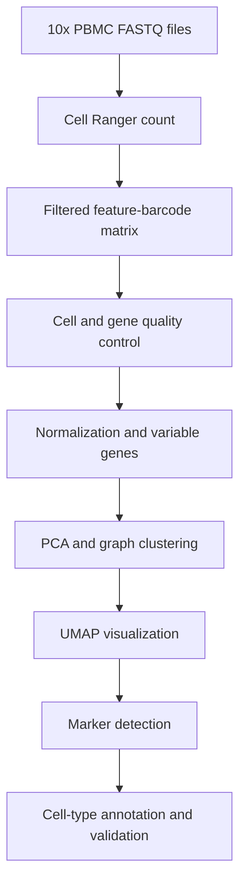

# End-to-End Single-Cell RNA-seq Analysis of Human PBMCs

[](https://www.r-project.org/)
[](https://satijalab.org/seurat/)
[](https://www.10xgenomics.com/)
[](https://www.10xgenomics.com/support/software/cell-ranger)
[](LICENSE)

## Project overview

This portfolio project demonstrates an end-to-end single-cell RNA-sequencing workflow using a publicly available human peripheral blood mononuclear cell (PBMC) dataset from 10x Genomics. Raw FASTQ reads were processed with Cell Ranger to perform alignment, barcode and UMI processing, cell calling, and gene-level quantification. The resulting filtered feature-barcode matrix was analyzed in R with Seurat for quality control, normalization, dimensionality reduction, graph-based clustering, marker detection, and immune-cell annotation.

The repository is designed to show both command-line/HPC workflow skills and biological interpretation of single-cell transcriptomic data.

> **Dataset alignment:** The Cell Ranger files shown for this project correspond to the 10x Genomics `pbmc_1k_v3` FASTQ dataset. The downstream Seurat analysis should therefore read the filtered matrix produced by that same Cell Ranger run. If the PBMC3k dataset is used instead, update the dataset name, paths, and reported metrics throughout this README.

## Skills demonstrated

- Linux and Bash-based processing of 10x Genomics FASTQ files
- Cell Ranger reference-based alignment and UMI counting
- Quality-control assessment and cell filtering
- Seurat preprocessing and highly variable gene selection
- PCA, nearest-neighbor graph construction, clustering, UMAP, and t-SNE
- Cluster marker detection and PBMC cell-type annotation
- Publication-quality visualization with `ggplot2`
- Reproducible organization of code, results, software versions, and data provenance

## Biological objective

The analysis asks whether transcriptionally distinct immune-cell populations can be recovered from an unsorted human PBMC sample and identified using canonical lineage markers. Expected broad populations include T cells, B cells, natural killer cells, monocytes, dendritic cells, and platelets. Cell labels are assigned only after evaluating cluster-enriched genes and established marker expression.

## Workflow



## Repository structure

```text
pbmc-1k-scrna-seq-cellranger-seurat/
├── README.md
├── LICENSE
├── .gitignore
├── environment/
│   ├── renv.lock
│   └── sessionInfo.txt
├── scripts/
│   ├── 01_cellranger_count.sh
│   ├── 02_seurat_qc_clustering.R
│   ├── 03_celltype_annotation.R
│   └── 04_export_results.R
├── data/
│   └── README.md
├── results/
│   ├── qc_summary.csv
│   ├── cluster_cell_counts.csv
│   ├── cluster_markers.csv
│   └── top_cluster_markers.csv
└── figures/
    ├── 01_qc_before_after.png
    ├── 02_pca_elbow.png
    ├── 03_umap_clusters.png
    ├── 04_umap_cell_types.png
    ├── 05_marker_dotplot.png
    └── 06_marker_heatmap.png
```

Raw FASTQs, reference genomes, Cell Ranger output directories, and serialized Seurat objects are intentionally excluded from version control because they are large and can be downloaded or regenerated.

## Dataset

- **Sample:** Human peripheral blood mononuclear cells
- **Assay:** 10x Genomics Chromium Single Cell 3′ Gene Expression v3
- **Input used for Cell Ranger:** `pbmc_1k_v3_fastqs.tar`
- **Source:** [10x Genomics Cell Ranger count tutorial and PBMC1k data](https://www.10xgenomics.com/support/software/cell-ranger/10.0/tutorials/cr-tutorial-ct)
- **Data license:** Confirm and report the license displayed on the 10x Genomics dataset page before redistributing any source files

The source data are not committed to this repository. Download instructions and checksums should be recorded in `data/README.md` so that the analysis can be reproduced without storing multi-gigabyte files in Git.

## Methods

### 1. FASTQ processing with Cell Ranger

The public FASTQ reads were processed with `cellranger count` against a compatible 10x Genomics human reference transcriptome. Replace the example paths below with local paths.

```bash
cellranger count \
  --id=run_count_1kpbmcs \
  --transcriptome=/path/to/refdata-gex-GRCh38-YYYY-A \
  --fastqs=/path/to/pbmc_1k_v3_fastqs \
  --sample=pbmc_1k_v3 \
  --expect-cells=1000 \
  --localcores=8 \
  --localmem=64
```

The primary input for Seurat is:

```text
run_count_1kpbmcs/outs/filtered_feature_bc_matrix/
```

The Cell Ranger web summary (`outs/web_summary.html`) should be inspected before downstream analysis. Report key metrics such as estimated cells, median genes per cell, median UMI counts per cell, reads mapped confidently to the transcriptome, and sequencing saturation in the results table below.

### 2. Quality control

The filtered feature-barcode matrix was imported using `Read10X()` and converted to a Seurat object. Per-cell quality metrics included:

- `nFeature_RNA`: number of genes detected per cell
- `nCount_RNA`: total UMI count per cell
- `percent.mt`: percentage of counts assigned to mitochondrial genes

Cells with very low feature counts may represent empty or low-quality droplets, cells with unusually high feature/count values may represent multiplets, and cells with elevated mitochondrial percentages may be damaged or stressed. Filtering thresholds were selected after examining metric distributions rather than being treated as universal defaults.

Record the final thresholds used in the analysis:

| Metric | Retention criterion | Rationale |
|---|---:|---|
| Detected genes | `200 < nFeature_RNA < 2,500` | Removes low-complexity droplets and unusually complex profiles |
| Mitochondrial reads | `percent.mt < 5` | Removes cells with high mitochondrial signal |
| Total UMI count | Report if used | Evaluated jointly with detected genes |

### 3. Normalization and feature selection

Counts were log-normalized with a scale factor of 10,000. The 2,000 most variable genes were identified using the variance-stabilizing transformation method. Expression values were scaled before principal component analysis.

### 4. Dimensionality reduction and clustering

PCA was used to summarize major transcriptional variation. The number of PCs used for neighbor detection was selected using the elbow plot and inspection of PC-associated genes. A shared nearest-neighbor graph was constructed, followed by graph-based clustering and UMAP visualization.

The clustering resolution is reported explicitly because it controls the granularity of recovered cell populations:

```text
PCs used: 1–10
Clustering resolution: 0.5
Random seed: [ADD SEED]
```

### 5. Marker detection and cell-type annotation

Positive cluster markers were identified using Seurat with minimum detection and log-fold-change thresholds. Cell identities were assigned by considering multiple canonical markers rather than a single gene.

| Cell population | Representative markers |
|---|---|
| Naive CD4 T cells | `CCR7`, `LTB`, `IL7R`, `MAL` |
| Memory CD4 T cells | `IL7R`, `LTB`, `IL32`, `MALAT1` |
| Cytotoxic T cells | `CD3D`, `CD3E`, `CD8A`, `CCL5` |
| B cells | `MS4A1`, `CD79A`, `CD37`, `CD74` |
| Natural killer cells | `NKG7`, `GNLY`, `PRF1`, `GZMB` |
| CD14+ monocytes | `LYZ`, `S100A8`, `S100A9`, `CTSD` |
| FCGR3A+ monocytes | `FCGR3A`, `LST1`, `IFITM3`, `LGALS3` |
| Dendritic cells | `FCER1A`, `CST3`, `CD1C` |
| Platelets | `PPBP`, `PF4`, `GNG11`, `NRGN` |

Verify every marker against the expression patterns in this dataset before retaining it in the final table. Remove markers that do not support the assigned identity.

If reference-based annotation is performed with SingleR, it should be presented as supporting evidence and compared with the marker-based labels. Disagreements should be reviewed rather than automatically overwritten.

## Results

### Cell Ranger and QC summary

Replace bracketed entries with values exported from `web_summary.html` and the Seurat object.

| Metric | Before QC | After QC |
|---|---:|---:|
| Estimated/retained cells | `[ADD]` | `[ADD]` |
| Median genes per cell | `[ADD]` | `[ADD]` |
| Median UMI counts per cell | `[ADD]` | `[ADD]` |
| Median mitochondrial percentage | `[ADD]` | `[ADD]` |
| Reads mapped confidently to transcriptome | `[ADD]%` | Not applicable |

### Quality-control distributions


The final text should state how many cells were removed and why the retained distributions were judged suitable for downstream analysis. Avoid describing filtering only as “standard QC.”

### Transcriptional clustering


Report the number of clusters recovered, the PCs and resolution used, and whether clusters were supported by distinct marker profiles.

### Annotated PBMC populations


### Marker-based validation


The marker dot plot is essential: it shows recruiters and reviewers that the labels are based on biological evidence rather than assigned only from cluster numbers.

### Main findings

Replace this section with 3–5 concise findings supported by your outputs. A suitable structure is:

1. After QC, `[N]` high-quality cell profiles were retained from `[N]` Cell Ranger-called cells.
2. Graph-based clustering resolved `[N]` transcriptionally distinct clusters.
3. Marker expression supported `[N]` broad PBMC populations, including `[LIST THE POPULATIONS ACTUALLY OBSERVED]`.
4. `[POPULATION]` was the most abundant population, accounting for `[X]%` of retained cells.
5. Manual marker-based and reference-based annotations agreed for `[X]%` of cells/clusters, with discrepancies concentrated in `[POPULATIONS]`.

Do not report treatment-associated differential expression for this dataset: it contains one biological sample and no treatment or replicate structure. Cluster marker analysis is appropriate, but it is not a substitute for replicated condition-level differential expression.

## Reproducibility

### Software

Record exact versions rather than listing package names alone:

```bash
cellranger --version
Rscript -e 'sessionInfo()' > environment/sessionInfo.txt
```

The R environment can be captured with `renv`:

```r
install.packages("renv")
renv::init()
renv::snapshot()
```

To restore the recorded R environment:

```r
install.packages("renv")
renv::restore()
```

### Run the downstream analysis

After Cell Ranger completes and the filtered matrix is available:

```bash
Rscript scripts/02_seurat_qc_clustering.R
Rscript scripts/03_celltype_annotation.R
Rscript scripts/04_export_results.R
```

All scripts should run non-interactively from the repository root. Package installation and `View()` calls should not appear in analysis scripts.

## Interpretation and limitations

- This is a single public PBMC sample, so the project demonstrates cell-level exploratory analysis and annotation rather than population-level statistical inference.
- Cluster identities depend on QC thresholds, PC selection, resolution, and the marker evidence used for annotation.
- Cell type and cell state can be difficult to distinguish using a shallow PBMC dataset; closely related T-cell populations should be labeled conservatively.
- Doublet detection can be added as a sensitivity analysis, but the method and expected doublet rate must be documented.
- There is no batch structure in a single-sample dataset, so batch integration is neither required nor demonstrable here.

## Why this project matters

This analysis connects raw-read processing, quantitative QC, unsupervised learning, and immune-cell biology in a reproducible workflow. It demonstrates the ability to move from sequencing files to interpretable biological results while documenting analytical decisions and limitations.

## References and resources

- [10x Genomics: running Cell Ranger count with the PBMC1k dataset](https://www.10xgenomics.com/support/software/cell-ranger/10.0/tutorials/cr-tutorial-ct)
- [10x Genomics: Cell Ranger gene-expression algorithm](https://www.10xgenomics.com/support/software/cell-ranger/latest/algorithms-overview/cr-gex-algorithm)
- [Seurat guided clustering tutorial](https://satijalab.org/seurat/articles/pbmc3k_tutorial)
- [Seurat documentation](https://satijalab.org/seurat/)

## Author

**Mahesh Chinthalapudi**  
Bioinformatics | Microbiome and multi-omics research  
[LinkedIn](ADD-LINK) · [GitHub](ADD-LINK) · [Email](mailto:ADD-EMAIL)

## License

Code in this repository is released under the MIT License. The 10x Genomics source data remain subject to the terms listed by the data provider and are not redistributed here.
